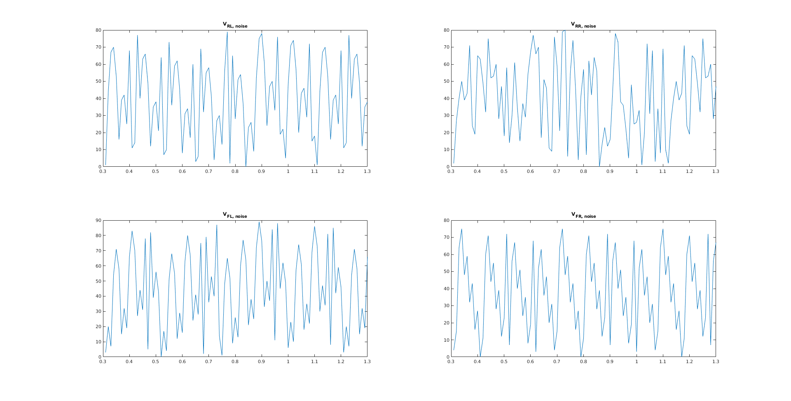

By only varying this seed, random data for the wheel velocities can be generated.

---

```matlab
% Generate own tire velocity data for testing using randomNumberGenerator()
% Will generate data up to 80 km/h per wheel

% Amount of data points
n = 1000;

% Create random test data
vrl_simulink_noise = randomNumberGenerator(5, 3, 80, 1, n);
vrr_simulink_noise = randomNumberGenerator(5, 3, 80, 2, n);
vfl_simulink_noise = randomNumberGenerator(5, 3, 80, 3, n);
vfr_simulink_noise = randomNumberGenerator(5, 3, 80, 4, n);

```

Plotted on a graph, the noise looks like this:

\
___


## D12


## D13

Using the steering wheel angle and lateral acceleration provided it should be possible to remove bias in the wheels speeds caused by curve driving. However, seeing as there are almost always significant intervals of straight driving, it would be easier to just use these to measure (relatively) unbiased wheel speeds for pressure monitoring.

## D14


eclipse.buildId=7.4.0.201811051313
java.version=1.8.0_191
java.vendor=Oracle Corporation
BootLoader constants: OS=win32, ARCH=x86_64, WS=win32, NL=de_DE
Command-line arguments:  -os win32 -ws win32 -arch x86_64

com.etas.ascet.eunit
Error
Sun Mar 24 23:12:15 CET 2019
Problem occured during code generation

