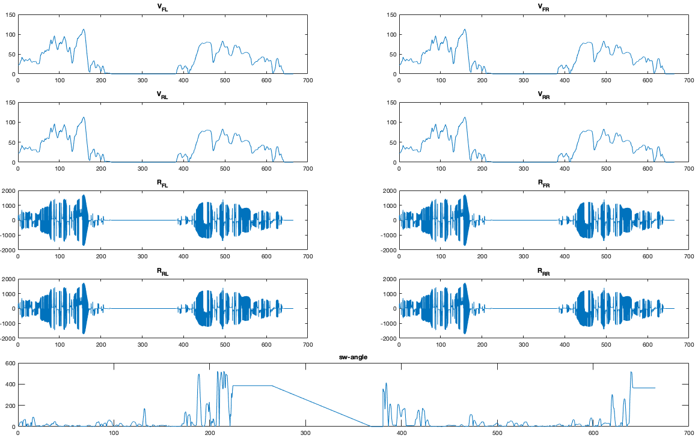
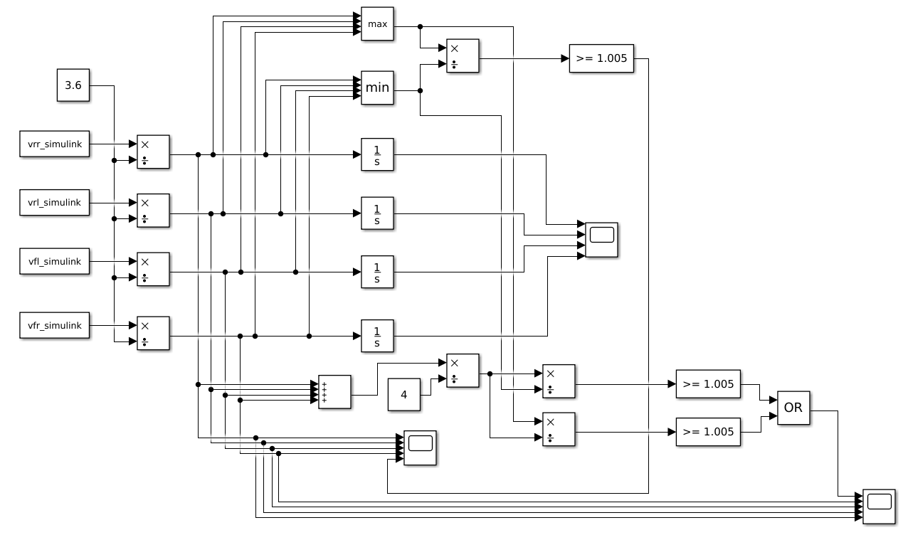
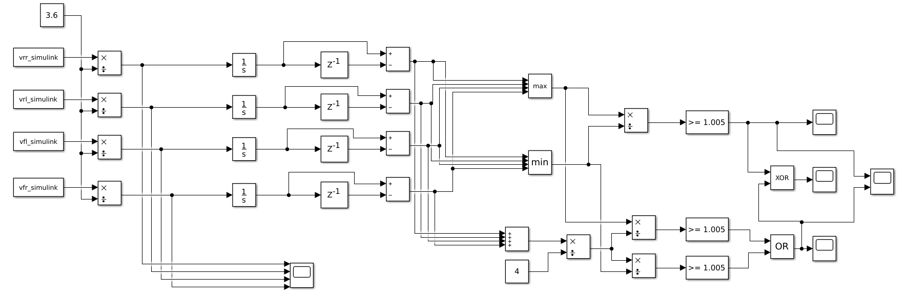
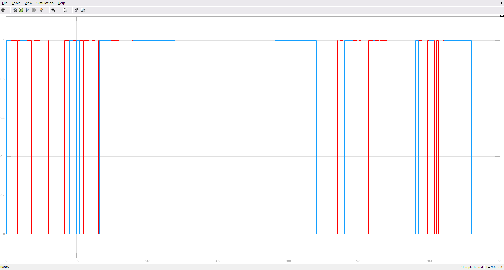
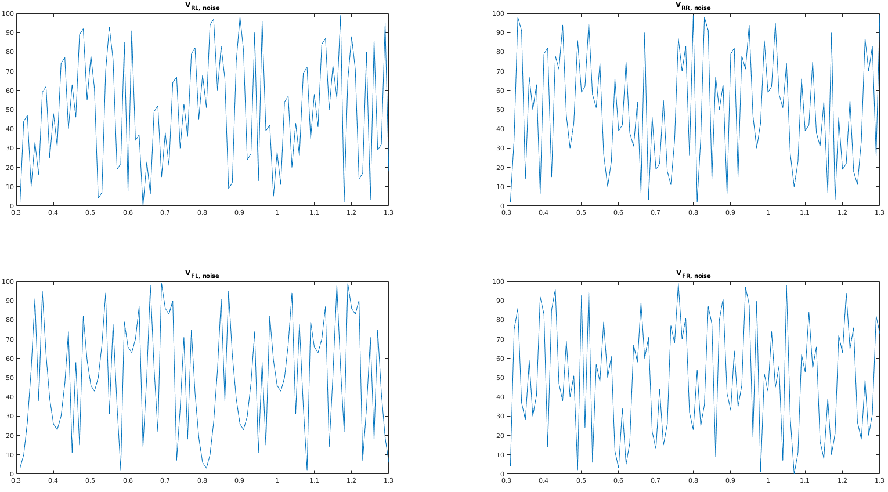

---
title: "Tire Pressure Monitoring"
author: 
	- 4588745
	- 2384618
date: 20.03.19
lang: en
...

\newpage

### Authors info

* 4588745 [Email](mailto:it16078@lehre.dhbw-stuttgart.de)
* 2384618 [Email](mailto:it16029@lehre.dhbw-stuttgart.de)

## D1

### Three Point estimates in Minutes

|  Task No. | Best Case | Likely Case | Worst Case |
| --- | --- | --- | --- |
|  D1 | 10 | 25 | 40 |
|  D2 | 60 | 80 | 160 |
|  D3 | 80 | 150 | 200 |
|  D4 | 40 | 80 | 160 |
|  D5 | 30 | 70 | 150 |
|  D6 | 50 | 100 | 160 |
|  D7 | 40 | 70 | 120 |
|  D8 | 30 | 50 | 120 |
|  D9 | 40 | 60 | 100 |
|  D10 | 30 | 60 | 120 |
|  D11 | 40 | 60 | 100 |
|  D12* | 40 | 70 | 100 |
|  D13* | 20 | 40 | 60 |
|  D14* | 30 | 50 | 70 |
|  Sum (min) | 540 | 965 | 1660 |
|  Sum (hours) | 9 | 16.08 | 27.67 |
|  Result (min) | 1010 |  |  |
|  Result (hours) | 16.83 |  |  |

## D2

Files: findRadius.m, script.m

The values of the curve.mat file have to be stripped for the required values. Then the `findRadius()` function located in `findRadius.m` is called to determine the curve radius of the car.

___

```matlab
b=2.65;
w=1.53;

vrl = matrix.vrl;
vrr = matrix.vrr;
vfl = matrix.vfl;
vfr = matrix.vfr;
tv = matrix.tv;
sw = matrix.sw;

vrl_simulink = [tv, vrl];
vrr_simulink = [tv, vrr];
vfl_simulink = [tv, vfl];
vfr_simulink = [tv, vfr];


% Get radiuses
[R_RR, R_RL, R_FR, R_FL] = findRadius(vrl, vrr, vfl, vfr, w, tv, sw);
```

___

Given the formulas 

$$R_{RR} = W + R_{RL}$$

and

$$\frac{V_x}{V_y} = \frac{R_x}{R_y}$$

and velocities for all the wheels during the entire duration of the test data one can determine the curve radiuses easily as such:

$$R_{RL} = \frac{W}{\frac{V_{RR}}{V_{RL}}-1}$$

$$R_{RR} = \frac{R_{RL} \cdot V_{RR}}{V_{RL}}$$

$$R_{FR} = \frac{R_{RL} \cdot V_{FR}}{V_{RL}}$$

$$R_{FL} = \frac{R_{RL} \cdot V_{FL}}{V_{RL}}$$

Another approach is the pythagoras formula which we ended up using in our final version.

$$R_{RL} = \frac{W}{\frac{V_{RR}}{V_{RL}}-1}$$

$$R_{RR} = R_{RL} + W$$

$$R_{FR} = \sqrt{W^2 + R_{RR}^2} \cdot signum(R_{RR})$$

$$R_{FL} = \sqrt{W^2 + R_{RL}^2} \cdot signum(R_{RR})$$

In `findRadius()`:

___

```matlab
w_m=zeros(size(tv));
w_m(:,1) = w;
R_RL=(w_m./((vrr./vrl)-1));
R_RR=R_RL+w;
% sign function ensures that all signs are the same
R_FR=(sqrt(w^2 + R_RR.^2)) .*sign(R_RR); 
R_FL=(sqrt(w^2 + R_RL.^2)) .*sign(R_RR);
```
___

To prevent errors, bad values like inf an NaN are replaced with 0.

___

```matlab
% Filter bad values
R_RR(isnan(R_RR)|isinf(R_RR)) = 0.0;
R_RL(isnan(R_RL)|isinf(R_RL)) = 0.0;
R_FR(isnan(R_FR)|isinf(R_FR)) = 0.0;
R_FL(isnan(R_FL)|isinf(R_FL)) = 0.0;
```

___

The resulting radiuses for each wheel together with their speeds and steering wheel are pictured below.



## D3

Files: D3.slx, script.m

The simulink model for D3 is provided with the velocities of the respective wheels of the vehicle. It converts the values that are given in $\frac{km}{h}$ into $\frac{m}{s}$ by dividing by 3.6. As to the Requirement R2, we think there are at least two interpretations of the word "imbalance". Both are present in the simulink model.



### Settings

|Start Time|Stop Time|Type         |Solver                    |
|----------|---------|-------------|--------------------------|
|0.0       |700      |Variable-step|Automatic solver selection|

Because we are not dealing with steep slopes in the signal these choice of solver does not really make any difference.

### First Interpretation (min-max)

If any two tires differ by 0.5% in their velocities, a drop is detected. This method is implemented by taking minimum and maximum values of the four velocities at any time and dividing them to see if the two most exteme wheels differ by 0.5%. A "1" in the blue/purple signal denominates if a tire pressure drop has been detected. The other signals represent the speeds of the respective wheels. This produces the following result:


### Second Interpretation (average)

The maximum and minimum velocities are compared to the average of all velocities. If either the minimum or maximum velocity differs by 0.5% an imbalance is detected. This produces the following result:


## D4

Files: D4.slx, script.m

If the difference between the maximum distance and the minimum distance is greater then 0.5% the system will detect tire pressure drop. This is essentially the same as D3 but with the travelled distance of the wheels instead of their velocities. A delay block is used to get a $\delta S = S(t) - S(t-10)$ which is the travelled speed in the last 10 time units. As in [D3][D3] there are two approaches to detecting an "imbalance" both of which can be seen below.



Again, using these two different approaches to detecting the imbalance as discussed in [D3][d3] we gets two different results. The [first approach][First Interpretation] is pictured in red and [the second][Second Interpretation] is pictured in blue. A "1" means that a pressure drop has been detected.



### Interpretation 1 (min-max)


### Interpretation 2 (average)


## D5

Files: randomNumberGenerator.m, script.m

The m and c parameters of the given random number generator are the upper and lower limit for the values generated. An initial value has to be chosen and functions as seed.

___

```matlab
%randomNumberGenerator.m

function [dataset] = randomNumberGenerator(a, c, m, seed, n)
% Generater random test data for D5
% seed = X(0)
% n = length
% a,c,m according to formula of task D5

% Preallocate return array
dataset = zeros(1, n);
% Set seed
dataset(1) = seed;

for i = 2:1:n
    dataset(i) = mod(round((a * dataset(i-1) + c)), round(m))
end
```

___

According to wikipedia for a random sequence of data, the parameters for a congruential number generator have to be chosen according to these rules:

1. c and m are relatively prime
2. a-1 is divisible by all prime factors of m
3. a-1 is a multiple of 4 if m is a multiple of 4
4. c is nonzero

Using these rules one can quickly determine four combinations for each wheel which fulfill all requirements for a period of 100.

|a |c |m | 
|--|--|--|
|21|23|100|
|11|13|100|
|31|17|100|
|41|11|100|

The seed can be chosen arbitrarily as there is no rule concerning it.

___

```matlab
% Generate own tire velocity noise for testing using randomNumberGenerator()

% Amount of data points
n = 100;

% Create random test data
vrl_simulink_noise = randomNumberGenerator(21, 23, 100, 1, n);
vrr_simulink_noise = randomNumberGenerator(11, 13, 100, 2, n);
vfl_simulink_noise = randomNumberGenerator(31, 17, 100, 3, n);
vfr_simulink_noise = randomNumberGenerator(41, 11, 100, 4, n);
```

___

Plotted on a graph, the pseudo-random noise looks like this:



## D6

Files: D6.slx, script.m

D6.slx is merely a copy of D4.slx that uses different input variables instead of `vx_simulink`. 

### Synopsis

In order to use the random number generator for our simulation we need to make the generated data more usable and more realistic. As it stands, the random number generator creates data that is too "noisy" meaning it changes too often. 

### Solution

Reducing "noisiness" can be achieved by stretching the signal along the x-axis using `imresize()` from the image toolbox. The y-axis needs to be resized as well to calibrate the noise to fit our model. First we create noise for a short interval (N = 500) also using the N  as M value. We use A = 11 for all wheels and different C values for each individual wheel according to the requirements for non-repetition in a given period for the linear congruental number generator in [D5][D5]. We subtract $\frac{m}{2}$ to get a signal that averages on the x-axis. Finally we divide by M get a signal that is between -0.5 and 0.5. Then we can use the stretch-y factor to calibrate the noise to our liking. 

___

```matlab
% D6

% Generate noise for short interval

n = 500;

% stretch factor

stretch_x = 5;
stretch_y = 1;

% Length of final signal

tv_length = 56093;

% Scale noise to be within bounds
vrl_rand = (randomNumberGenerator(11, 11, n, 4, n) - n/2 ) ./ n * stretch_y;
vrr_rand = (randomNumberGenerator(11, 31, n, 10, n) - n/2) ./ n * stretch_y;
vfl_rand = (randomNumberGenerator(11, 23, n, 14, n) - n/2) ./ n * stretch_y;
vfr_rand = (randomNumberGenerator(11, 121, n, 18, n) - n/2) ./ n * stretch_y;
```

___

This in itself would result in a very busy signal. So we use the `imresize()` to stretch along the x-axis and finally stretch to the length of our timebase `tv` as specified in `curve.mat` to use it in simulink.

___

```matlab
% Reduce "jumpiness" in noise by stretching
vrl_rand = imresize(vrl_rand, [stretch_x*n 1], 'nearest');
vrr_rand = imresize(vrr_rand, [stretch_x*n 1], 'nearest');
vfl_rand = imresize(vfl_rand, [stretch_x*n 1], 'nearest');
vfr_rand = imresize(vfr_rand, [stretch_x*n 1], 'nearest'); 

vrl_rand = vrl_rand(1:n);
vrr_rand = vrr_rand(1:n);
vfl_rand = vfl_rand(1:n);
vfr_rand = vfr_rand(1:n);

vrl_rand = imresize(vrl_rand, [56093 1], 'nearest');
vrr_rand = imresize(vrr_rand, [56093 1], 'nearest');
vfl_rand = imresize(vfl_rand, [56093 1], 'nearest');
vfr_rand = imresize(vfr_rand, [56093 1], 'nearest');

vrl_simulink_rand = [tv, vrl_rand];
vrr_simulink_rand = [tv, vrr_rand];
vfl_simulink_rand = [tv, vfl_rand];
vfr_simulink_rand = [tv, vfr_rand];

```
___

Plotting the resulting signal with `tv` we get a nice spread of noise across the whole duration of the simulation.

 

### Simulink test


We use a modified version of the [D4 model][D4] that adds an offset of $50\frac{km}{h}$ and uses the `vx_simulink_rand` variables from our workspace with our noise. Here are the incomming noise signals with the offset in $\frac{m}{s}$:


Using the two imbalance detections from [D3][D3] and [D4][D4] we can detect a tire pressure drop in our test data.


### Interpretation 1 (min-max)


### Interpretation 2 (average)


By varying the seed of the random number generator we can run the simulation with different random data and test its ability to detect tire pressure change.

## D7 


This function uses the distanceCalc class to calculate the distance each wheel travels. The comparePressure class returns true if there is an imbalance between the distanceCalc class and the distanceCalc class. These classes will be explained below.


The function returns the distance one wheel travels during one time slot. The speed of the wheel is giving in km/h the distance returned is in meter.


This function does the same as the average function described in D5.

## D8

___

```java
static class distanceCalcTest{
	
	@Test
	public void test1() {
		Assert.assertNear(distanceCalc.calcDistance(3.6, 0.5), 0.5, 0.0001);
		
	}
	
}
```

___

For the calcDistance funtion only one test case is necessary. The assert Near is required because the result is from the type real.

___

```java
static class comparePressureTest{
	
	@Test
	public void test1() {
		Assert.assertTrue(comparePressure.comp(5.0,5.0,5.0, 5.5));
		
	}
	
	@Test
	public void test2(){
		Assert.assertTrue(comparePressure.comp(3.0,3.0,3.0, 2.5));
	}
	
	@Test
	public void test3() {
		Assert.assertFalse(comparePressure.comp(5.0,5.0,5.0, 5.03));
		
	}
	
	@Test
	public void test4(){
		Assert.assertFalse(comparePressure.comp(3.0,3.0,3.0, 2.985));
	}
}
```
___

The `comparePressure` class is tested with four tests. test1 and test2 test if the function returns true if there is an imbalance of more than 0.5% of one wheel.
test3 and test4 test that the function returns false if the distances are less than 0.5% apart. With these four tests all possibilities are covered. 


___

```java
static class detectDropTest{
	
	@Test
	public void test1() {
		Assert.assertFalse(detectDrop.detect(70.2, 70.0, 70.3,69.8,0.01 ));
	}
	
	@Test
	public void test2() {
		Assert.assertTrue(detectDrop.detect(75.4, 70.0, 71.0,69.5,0.01 ));
	}
}
```
___


In order to test the `detectDrop` class, it is only necessary to test once whether it detects the pressure drop at different speeds if they exceed 0.5% and no pressure drop if they are below 0.5%. 


## D9


The warning function sets the lamp on if the a drop is detected and use the statemachine to toggle the sound variable. 


The statemachine has four states. The shortState is for the short sound, the longState is for the long sound. The breakState is for the brake between the sounds and the mockState starts the procedure from beginning. `dt_` is the delta time and an input variable. on is an output.

___

```java
class warningFunction {
	@get
	private boolean on = false;
	integer counter;
	@set
	private real dt_;
	real restTime;
	real base_rate = 0.8;
	real break_rate = 0.1;
```

___

## D10


The random number generator uses the formula described in [D5][D5]. The type `int_m` is required because otherwise the first expression is always zero.

___

```java
type int_m is integer 0 .. 300;
static class randomNumberGenerator {
	int_m X = 3;

	@generated("blockdiagram")
	public integer random(int_m in a, int_m in c, int_m in m) {
		X = (((a * X) + c) % m); // Main/random 1
		return X; // Main/random 2
	}
}
```

___

300 is the maximum because there will be no higher input values. 

___

```java
static class randomNumberGeneratorTest{
	
	@Test
	public void test1() {
		Assert.assertIntEqual(randomNumberGenerator.random(3,23,157),32);
		Assert.assertIntEqual(randomNumberGenerator.random(3,23,157),119);
		Assert.assertIntEqual(randomNumberGenerator.random(3,23,157),66);
	}
}
```

___

To test the random number generator, it is called three times in a row, since the previous value is required for the calculation. 

## D11  

## D12

## D13

Using the steering wheel angle and lateral acceleration provided it should be possible to remove bias in the wheels speeds caused by curve driving. However, seeing as there are almost always significant intervals of straight driving, it would be easier to just use these to measure (relatively) unbiased wheel speeds for pressure monitoring.

## D14

0.5 % is a really narrow definition of an imbalance and using the random number generator it is easy to run into the imbalance state.


